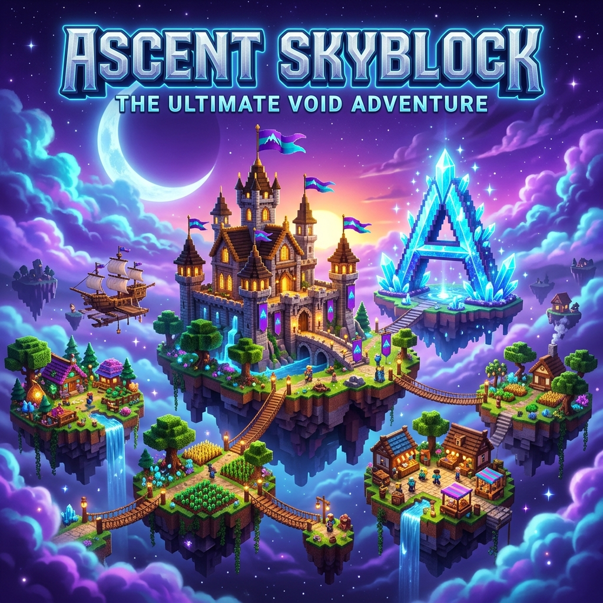
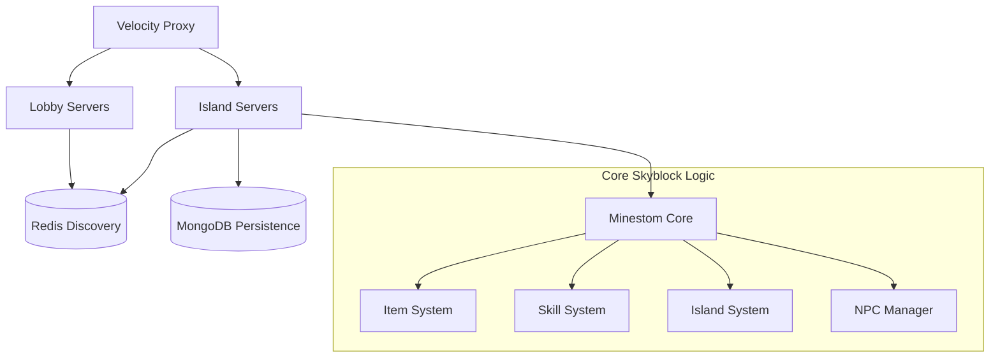

# 🌌 Ascent Skyblock



Welcome to **Ascent Skyblock**, a high-fidelity, high-performance Skyblock implementation for Minestom. This project aims to replicate and enhance the core mechanics of modern Skyblock servers with a modular, scalable architecture.

---

## ✨ Key Features

- **🏝️ Dynamic Island System**: Fully persistent islands using the Polar world format. Supports instant loading and multi-server synchronization.
- **⛏️ Advanced Block Mechanics**: Custom block breaking system with 100% block coverage, Skyblock items, skill XP rewards, and collection tracking.
- **📊 Progression & Skills**: Fully implemented skill system (Mining, Farming, Foraging, etc.) with level-up rewards and action bar feedback.
- **🎒 Item & Inventory System**: Deep integration with Hypixel-style items, custom rarities, and NBT-based persistence.
- **🤖 Smart Entities & Minions**: Intelligent minions that automate resource gathering and interact with your island.
- **📡 Scalable Cluster Architecture**: Redis-based server discovery, Velocity proxy integration, and multi-module design.

---

## 🏗️ Project Architecture

Ascent Skyblock is built as a distributed system of specialized microservices and game servers.



---

## 🛠️ Modules Overview

| Module | Description |
| :--- | :--- |
| `core-skyblock` | The primary business logic for Skyblock (Items, Skills, Collections, NPCs). |
| `core-proxy` | Velocity proxy implementation with dynamic server discovery. |
| `core-lobby` | The lobby experience, menus, and server selectors. |
| `skyblock.island` | Specialized island server wrapper for hosting player islands. |
| `skyblock.hub` | The main Hub server implementation. |
| `commons` | Shared DTOs, utilities, and Redis communication logic. |
| `database` | MongoDB repository and caching layer. |

---

## 🚀 Getting Started

### Prerequisites

- **Java 21+** (Corretto recommended)
- **Docker & Docker Compose**
- **MongoDB & Redis**

### Development Setup

1. **Clone the repository**:
   ```bash
   git clone https://github.com/HajimeOnodera56/AscentDevv.git
   cd AscentDevv
   ```

2. **Build the project**:
   ```bash
   ./gradlew shadowJar
   ```

3. **Launch the stack**:
   ```bash
   docker compose up --build -d
   ```

---

## 🎨 Design Philosophy

Ascent is designed with **Aesthetics** and **Performance** in mind. Every interaction, from the block breaking particles to the action bar XP gain, is optimized for a premium player experience.

> [!TIP]
> Use the `/itemlist` command in-game to browse all registered Skyblock items and test the drop system!

---

Developed with ❤️ by the **Ascent Dev Team**.
